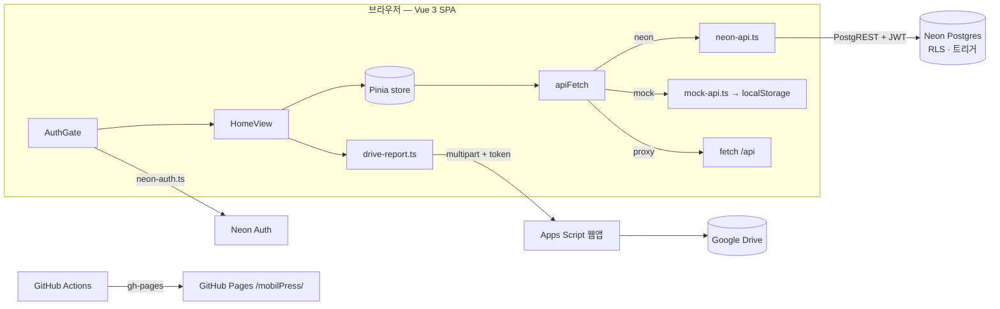

# 아키텍처 (ARCHITECTURE)

MobilPress 는 서버 코드가 없는 **정적 SPA** 입니다. 브라우저가 Neon(Postgres Data API + Auth)과
Google Drive(Apps Script)를 직접 호출하고, GitHub Pages 가 정적 파일만 서빙합니다.



## 1. 데이터 소스 모드

`src/lib/api.ts` 의 `dataMode` 가 `VITE_DATA_MODE` 를 읽어 `mock | neon | proxy` 를 정하고,
`apiFetch(path, options)` 가 모드에 따라 구현을 **동적 import** 합니다. 화면·스토어는 어느 모드든
같은 `'/mobil-press/*'` 경로와 `Response` 형태만 봅니다.

| 경로 | 메서드 | neon-api.ts 가 하는 일 |
|---|---|---|
| `/mobil-press/data` | GET | `customers` · `installations` · `budget_entries` 세 테이블을 한 번에 읽어 합침 |
| `/mobil-press/customers`, `/installations`, `/budget_entries` (+`/:id`) | POST / PATCH / DELETE | 해당 테이블 insert / update / delete. 응답 행을 다시 camelCase 로 변환 |
| `/mobil-press/access-logs`, `/audit-logs` | GET | 접속기록·변경이력 (+`user_directory` 로 이름 매핑) |
| `/mobil-press/members` | GET / PATCH | `user_accounts` 뷰 조회, `user_roles` upsert (admin 전용) |

`mock-api.ts` 는 같은 경로를 localStorage(`mobilpress-mock-db`) 위에서 흉내 냅니다. 로그인이 없으므로
`auth-state.ts` 는 mock/proxy 모드를 **admin 과 동일**하게 취급합니다.

## 2. 인증과 권한

### 로그인 흐름

1. `App.vue` → `AuthGate` 가 `authEnabled`(neon 모드 + URL 설정 완료)일 때만 게이트를 세웁니다.
   `/reset-password` 는 이메일 링크 랜딩이라 게이트를 통과시킵니다.
2. `refreshUser()` 가 `@/lib/neon-auth` 를 동적 import 해 `getCurrentUser()` 로 세션을 확인합니다.
3. 사용자가 있으면 **즉시** `HomeView` 가 마운트되어 `store.loadData()` 를 시작하고, 같은 시점에
   `user_roles` 조회(`rolePromise`)가 병렬로 돌아갑니다. 역할이 오면 `canEdit / canDelete / isAdmin` 이
   반응적으로 바뀌어 관리자 탭·수정 버튼이 나타납니다(2026-09-06 이전에는 역할 조회가 끝나야 첫 화면이 떴음).
4. `idle-logout.ts` 가 30분 무활동 시 `signOut()` 을 호출합니다. 타이머가 아니라 타임스탬프
   (localStorage 로 탭 간 공유)로 판정해 절전·백그라운드에서도 정확합니다.

### 역할과 RLS

역할은 `public.user_roles(user_id, role)` 한 테이블입니다. 행이 없으면 `user`.

| 역할 | 앱(auth-state) | DB(RLS) |
|---|---|---|
| user | 조회만. 보고서 미리보기 가능, 다운로드 불가 | select 만 허용 |
| staff | 등록·수정, 보고서 업로드/다운로드 | `is_staff()` 가 insert/update 허용 |
| admin | 삭제, 보고서 첨부 해제, 접속기록·변경이력·회원관리 탭 | `is_admin()` 이 delete 와 `user_roles` 쓰기 허용 |

- 앱은 **반드시 본인 `user_id` 로 필터**해 역할을 읽습니다. admin 은 RLS 로 전체 행이 보이므로 필터 없이
  첫 행을 읽으면 남의 역할을 자기 것으로 오인합니다.
- 화면의 권한 표시는 UX 이고 실제 보호는 RLS 입니다. Drive 업로드도 Apps Script 의
  `REQUIRE_ROLE_CHECK` 를 켜면 서버에서 JWT 로 역할을 재검증합니다.
- 감사: `audit_logs`(세 업무 테이블의 insert/update/delete 트리거), `access_logs`
  (`neon_auth."session"` 생성/삭제 트리거로 로그인·로그아웃과 체류시간 기록). 둘 다 admin 만 조회.

전체 정의는 `db/schema.sql`, 운영 SQL 은 [ROLES.md](ROLES.md).

## 3. 화면과 상태

- `HomeView.vue` 하나가 대시보드 셸입니다. 탭: 장착 실적 · 실적 분석(고객별/월별) · 예산 집행 ·
  운영자료 · (admin) 접속기록 · 회원관리. 검색·등록 버튼·언어 전환·로그아웃이 헤더에 있습니다.
- `stores/mobilPress.ts`(Pinia) 가 `customers / installations / budgetEntries` 원본과 검색 필터,
  매출 집계(`revenueByCustomer / revenueByMonth`), CRUD, 시드(`seedFromReport`)를 가집니다.
  집계는 `computed` 로 한 번만 계산하고 행마다 배열을 훑지 않습니다(Map 사전 구성).
- 모달과 참고자료 컴포넌트는 `defineAsyncComponent` 로 **열 때만** 로드됩니다.
- 시드: `data/seed.ts` 는 폼 기본값과 `SEED_COUNTS` 만 초기 번들에 두고, 실제 행(`seed-report.ts`)은
  버튼을 눌렀을 때 동적 import 합니다. 개발 모드에서 두 파일의 건수를 대조합니다.
- i18n: `lib/i18n.ts` 의 `t(key)`. 인도네시아어 기본, 한국어 보조, 선택은 localStorage 에 저장되고
  `<html lang>` 도 함께 바뀝니다.
- 스타일: Tailwind v4 CSS-first. 색·글자체 토큰은 `assets/main.css` 의 `@theme inline` 에 있고
  AsuraDB 디자인 가이드를 따릅니다.

## 4. 파일 저장 (Google Drive)

Neon Data API 에는 파일 저장소가 없어 작업보고서 PDF 와 주행거리계 사진은 Drive 에 둡니다.

- `lib/drive-report.ts` 가 `VITE_DRIVE_UPLOAD_URL`(Apps Script `/exec`)로 multipart 업로드하고,
  DB 에는 `report_file_id / report_file_name`(최대 3개), `odometer_file_id / _name` 만 저장합니다.
- 파일명 접두어로 종류를 구분합니다: 작업보고서 `LK_…`, 주행거리계 사진 `KM_…`.
- 삭제는 Drive 휴지통 이동입니다. 장착 실적을 지우면 첨부도 함께 지우고, 모달을 취소하면
  방금 올린 파일을 정리해 고아 파일이 남지 않게 합니다.
- `VITE_DRIVE_UPLOAD_TOKEN` 은 번들에 포함되는 값이라 비밀이 아니라 무작위 호출 차단용입니다.
  실질적 보호는 Drive 폴더 권한 + Apps Script 실행 계정 + (선택) 역할 재검증입니다.

## 5. 빌드와 번들 구성

`vite.config.ts`:

- `base` 는 production 에서 `/mobilPress/`(GitHub Pages 하위 경로). 라우터도 `BASE_URL` 을 씁니다.
- `manualChunks` 로 `vue`(vue/router/pinia) · `neon`(@neondatabase/@better-auth/zod) · `icons`(lucide) ·
  `vendor`(나머지, 사실상 vue-sonner) 를 분리해 앱 코드가 바뀌어도 라이브러리 캐시가 유지됩니다.
- Neon SDK 는 `neon-auth.ts` / `neon-api.ts` 를 통해 **동적 import 로만** 들어오므로 mock 빌드에는
  포함되지 않습니다. 대신 neon 모드에서는 첫 화면이 반드시 필요로 하므로 `preloadNeonChunks` 플러그인이
  `neon / neon-auth / neon-api` 청크에 `<link rel="modulepreload">` 를 주입해 index 청크 파싱을
  기다리지 않고 내려받게 합니다.
- 폰트: `scripts/build-fonts.mjs` 가 `node_modules/pretendard` 에서 굵기 400/500/600/700 의
  woff2 만 골라 `public/fonts/` 에 만들고(`postinstall / prebuild / predev`), `index.html` 이
  같은 출처의 `/fonts/pretendard.css` 하나만 링크합니다. 외부 CDN 폰트는 별도 출처 왕복과
  @font-face 828개 때문에 첫 렌더를 약 1초 막았습니다(CHANGELOG 2026-09-06).

2026-09-06 기준 초기 로드(neon, gzip): index 19.6 kB + vue 40 kB + vendor 20.5 kB + icons 2.5 kB +
CSS 6 kB + 폰트 CSS 52 kB, 그리고 modulepreload 되는 neon 77 kB. 상세 표는 CHANGELOG.

## 6. 배포 파이프라인

```
git push main ──▶ .github/workflows/deploy.yml
                    npm ci → npm run predeploy (build + 404.html 복사) → gh-pages 브랜치
                    env: 리포지토리 secrets 5개 (VITE_DATA_MODE, NEON URL 2, DRIVE 2)
gh-pages ──▶ GitHub Pages https://hungaseo-arch.github.io/mobilPress/  (cache-control 600s)
```

- `404.html` 은 `index.html` 복사본입니다. GitHub Pages 가 `/mobilPress/reset-password` 같은
  깊은 경로에서 404 를 내면 이 파일이 앱을 띄우고 Vue Router 가 경로를 처리합니다.
- secrets 가 비어 있으면 그 기능이 빠진 채 배포됩니다. 규칙은 [CONTRIBUTING.md](CONTRIBUTING.md) "배포 규칙".

## 7. 알려진 제약

- 파일은 Drive, 데이터는 Neon 이라 둘 사이 트랜잭션이 없습니다. 실패 시 앱이 정리(휴지통 이동)를
  시도하지만 네트워크가 끊기면 고아 파일이 남을 수 있습니다.
- Data API 는 PostgREST 이므로 새 컬럼은 **Refresh schema cache** 후에야 보입니다.
- 역할 조회를 첫 화면과 병렬로 돌리므로 admin 탭이 수백 ms 늦게 나타납니다. 권한 확정을 기다려야 하는
  화면이 생기면 `auth-state.ts` 의 `rolePromise` 를 await 합니다.
- 인증 없는 mock/proxy 모드는 모든 권한이 열려 있으므로 운영에 쓰지 않습니다.
